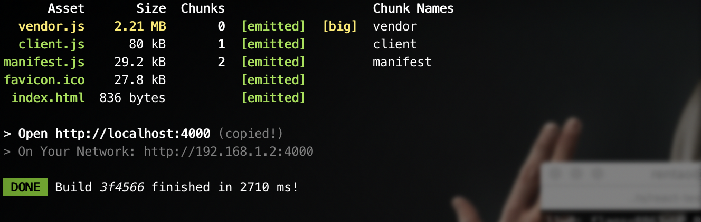
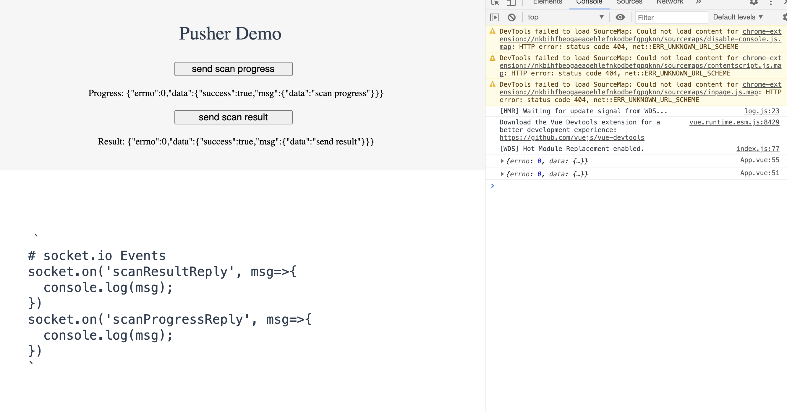
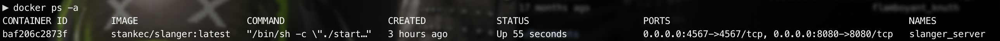
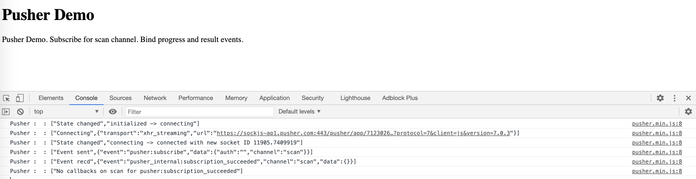

# PusherDemo
A pusher demo based on pusher and slanger.


# Vue + Socket.IO
## start a socket.io server
run a websocket server on 8080.
```
npm i
npm run server
```

## run vue client
```
cd pusher-vue
npm i
npm run dev
```



# Slanger + Pusher
## Apply Pusher Account
Register a pusher account to get AK, SK.

[pusher](https://dashboard.pusher.com/)
## deploy slanger
Make sure you have redis and docker on your environment.
 ### Download and Deploy Slanger Server
 > Need docker daemon

 > Edit start_server.sh to replace your APP_KEY, SK, Redis Server Address.
 ```
 ./download_server.sh
 ./start_server.sh
 ```

 ### Check your Slanger Server Docker
 ```
 sudo docker ps -a
 ```
 If you have deployed Slanger docker successfully, you will see following results.
 
 

## Open Client

Edit client.html to replace key and cluster.
> open client.html


